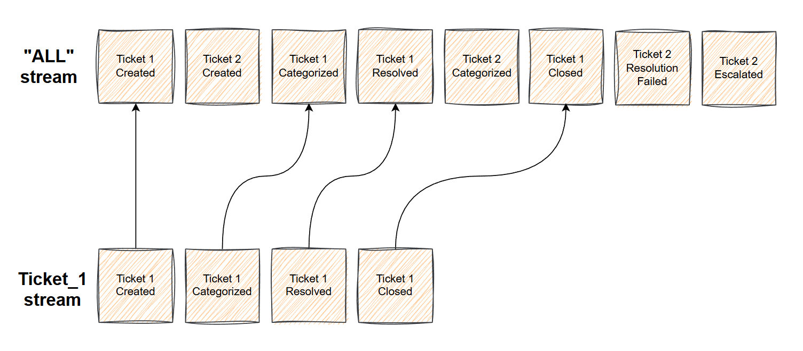

Event Store
===========

This module describes principles of work of the event store in the Bestagon framework.

The event store in Bestagon is represented by the `EventStore` class.
This is a pure abstract interface that contains a set of methods that describe the set of requirements
an event store should satisfy. The main purpose of the class is to hide the concrete storage technology
like relational databases or specialized event stores behind the interface and reduce coupling to the
technical details.

The Bestagon provides implementations of event stores out of the box:

    - `KurrentDBEventStore` - uses KurrentDB as underlying storage and is suitable for projects
      where performance and scalability is crucial.
    - `AIOSQLiteEventStore` - uses SQLite as underlying storage (`aiosqlite`)
      and it is a perfect choice for quick prototyping and simple projects.

If your project requires a specific storage technology to use that is not provided by Bestagon,
then you can create your own implementation by subclassing the `EventStore`
class and reimplementing the abstract methods.

Basic concepts
--------------

Conceptually, the event store can be represented as a long stream of events in chronological order -
append only, immutable event log.
Every time new events are added to the event store, they are appended to the end of the stream.
This behavior is intentional. Once appended, events cannot be changed, and should stay in
the event store as long as the system exists.
There is no event retention mechanism like in event transport systems, for example Kafka.

There are two types of streams in the event store:

- "All" stream. It contains all the events in the event store in chronological order.
  You usually do not query this stream for specific events, instead you subscribe to 'all' and react
  to new events as they appear.

- The second type of stream is an aggregate stream.
  It contains only events related to a specific aggregate and has a globally unique name (usually ID
  of the aggregate it represents).

Appending events
----------------

The `EventStore` class provides the `append_events` method to add new events.
The method accepts 3 parameters:

- stream_name - it should be a non-empty string that is unique across the whole event store.

- events - this is a collection of new events to append.
  Each event must be an instance of `NewEventStoreEvent` that contains the type of the event,
  payload and metadata as bytes.

- expected_version - this is one of the optimistic concurrency control mechanisms of the event store,
  and it expects whether an integer or None if the stream does not exist.

The optimistic concurrncy mechanism provided by `expected_version` parameter deserves an additional explanation.
Under the hood the event store checks whether the expected version is equal to the current stream version and
raises an `ExpectedVersionError` if they do not match.
As an example, imagine a situation when two users modify the same aggregate.
When they start to modify the aggregate the stream version is 5 (for example) and it is equal to the last version of the saved aggregate.
The first user finishes to modify the aggregate and saves the changes. As a result, 2 new events have been created in
the aggregate and saved in the event store.
At this moment event store receives two new events and 5 as an expected version (the version of the aggregate before
the changes), it validates that the expected version is equal to the stream version and writes the events.
Now the stream version is 7, because of the two new events and the aggregate also have new version equal to 7.
At the same time the second user still works with the old version of the aggregate equal to 5.
When user tries to save the aggregate, the event store receives 5 as expected version and raises `ExpectedVersionError`
because the current version of the stream is already 7, therefore rejecting the changes made by the second user.

To check the current version of the stream, use `get_stream_version` method, but it should not be recommended to
use it when saving new events, because in such case you are bypassing the optimistic concurrency mechanism and it can easily corrupt your data.

Retrieving events
-----------------

To retrieve events, the event store provides `get_stream` method.
This method returns all the events for the stream provided by `stream_name` parameter as a tuple of `EventStoreEvent` instances.
Each event contains several fields:

- stream_name - name of the stream the event belongs to.
- stream_position - the position of the event in the aggregate sequence.
- commit_position - a global position of the event in the 'all' stream.
- event_type - the type of the event.
- payload - contains business-specific information that answers what exactly has changed in your domain
- metadata - contains non-domain-related information, for example, the timestamp when event was created, ID of the aggregate that generated an event, etc.

To check that a specific stream exists, you can use `stream_exists` method, which returns True if the provided stream exists in the event store.

Subscriptions
-------------

One of the main requirements for the event store is that it should have a subscription mechanism as a first class feature.
All concrete event stores implemented in Bestagon framework provide this feature out of the box.

The Bestagon's `EventStore` abstract interface contains several methods to create a subscription to the event store:
`create_subscription` and several convenience methods - `create_subscription_to_all`, `create_subscription_to_events` and
`create_subscription_to_stream`.

The `create_subscription` method is the main method to subscribe to event store's events. It accepts two parameters:
`subscription_name`, and `subscription_parameters`.

Subscription parameters is a subclass of `SubscriptionParameters` class.
This class should be reimplemented for each concrete storage technology to contain necessary subscription parameters
for the underlying storage. For example, `KurrentDBSubscriptionParameters` contains all the parameters required to
create a subscription to KurrentDB event store.

.. autoclass:: bestagon.adapters.kurrent.KurrentDBSubscriptionParameters
   :members:
   :undoc-members:
   :show-inheritance:

The `create_subscription` method returns an instance of `EventStoreSubscription`. To consume events you can use two
methods:

- Consequitevely call `next_event` method when necesary.
- Use it as async iterator:

.. code-block:: python

    async for event in subscription:
        await process_event(event)

Code reference
--------------

.. automodule:: bestagon.core.event_store
   :members:
   :show-inheritance:
   :undoc-members: