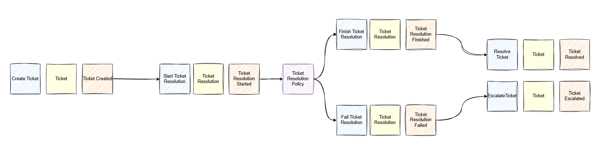
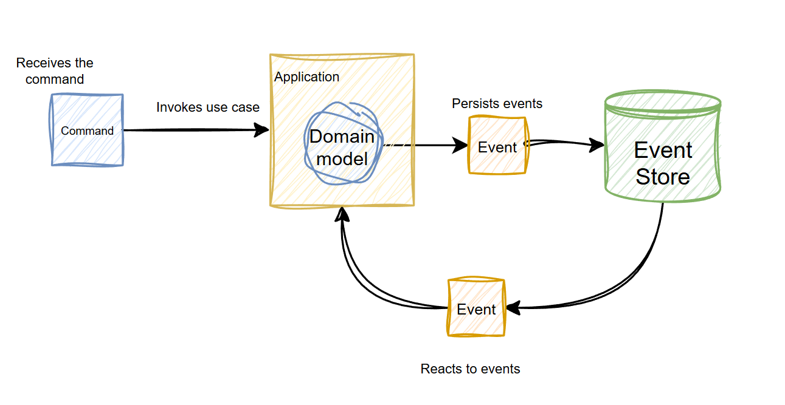
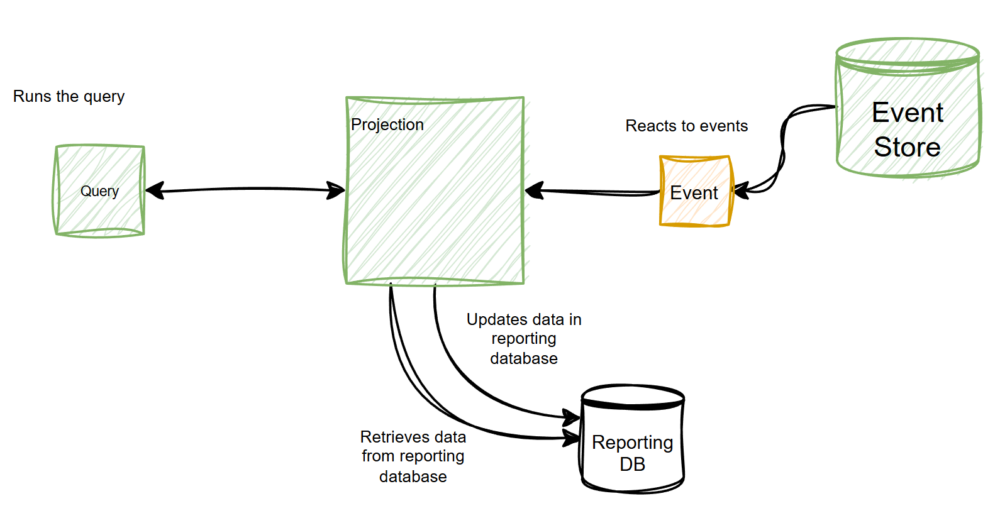
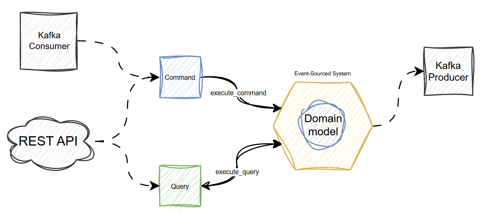

========
Overview
========

This chapter will give you a necessary architectural and conceptual overview of the framework.

The main components of the framework can be split into several categories:
    - Domain model
    - Application
    - Projection
    - System
    - Adapters

Lets take a look at each category in details.

Domain model
------------
Domain model is the core and the most important part of the event-sourced system. This is the first
component you start to implement when working with the Bestagon and this is where most
part of the efforts should be concentrated.

The domain model describes behavior, data and the communication between your business entities.
It consist of one or several event-sourced aggregates each of which represents a specific business
entity. Aggregates contain all the business logic that exists in your domain and serve as a
source of domain events. Every time something changed in a specific aggregate it is
recorded as a domain event and then persisted in the event store, therefore forming the
sequence of all business events that happened in your domain, so called source of truth.

Event-sourced application
-------------------------

The aggregates by themselves does not provide any mechanism for communication
with each other and are not able to react to the events generated by other aggregates.
Moreover, it is very common case where multiple aggregates are involved in one business operation and should be accessed at the same
time in a single use case. The aplication is designed to address this problem.

Application is a crucial part of the event-sourced system. It implements a write side of the system and fullfils multiple functions:

    - It is a place where your domain model lives. Every application owns it's own domain model and hides it from
      other components of the system.

    - It implements use cases. You do not work with aggregates directly. Whenever you need to run some business logic you first create
      a use case in your application. This use case must receive a `Command` as an input and inside the use case you
      execute business logic by creating, modifying aggregates and saveing the changs in repository.

    - Provides an access to repository that allows to retrieve and save aggregates.

    - Provides an ability to react to other events, that are triggered by yur domain model.

.. note::
    There can be multiple applications inside one event-sourced system. Multiple applications allow you
    to split a complex domain model into several smaller and more manageable pieces.

Projection
----------

Applications implement the write side of your event-sourced system - they execute the actual
use cases and make the events appear, but it is very difficult to query such system to get
necessary information and this is what `Projection` designed for.

Projection implements a read side of the event-sourced system and allows you to retreive the vast
variety of information from your system.
Similar to application projection can react to specified events, but instead of executing use cases,
projection writes information to the reporting database, for example SQLite, Neo4j and so on, that can be easily
queried to retrieve necessary information.

Bestagon allows you to build any number of projections using any storage as the reporting database.
One of the most powerfull features of the projection that it can be safely rebuild if you need to
make changes in your schema or dropped completely when necessary without the fear to lose information, because
it is always can be rebuilt from events.

Event-Sourced System
--------------------

The next important component is an Event-Sourced System. The Domain Model, Applications and Projections form the core
of your system. This core should not be properly configured and hidden from the outside world.
`EventSourcedSystem` is designed for this purpose and it fullfils two important functions:

First of all the system serves as a glue that ties all the components together, it owns applications and projections,
sets up subscriptions and also can implement additional automations that can be used in advanced workflows that require
both aplications and projections.

The second, and the most important function - the system serves as a boundary around your core and all the communication
with the outside world is being carried only through this boundary. To make it happen the system exposes two methods:
`execute_command` and `execute_query`. All primary adapters, like REST API, Kafka producers communicate with the system
only using these methods by sending commands and queries. The core should not be accessed directly by the
the outside world and the system's boundary protects it from such exposure.

.. note::
   The command and queries are the only way the system communicates with the outside world.

The commands and queries by their nature have a clear separation of concerns:

`Command` is what drives business logic inside the system. When executed the command changes the state of the system
by executing a specific use case.

`Query` on the other hand, never executes business logic and, therfore, never changes the state of the system.
Its goal is to retrieve the necessary data from the system, for analytical and other purposes.

Adapters
--------

Adapters are any technical details that can be attached to the system.
There are two types of adapters - primary and secondary.

Primary adapters ar exposed to the outside world and serve as a translators to turn incoming message into correct
command or query to be executed by the system. The most common primary adapters include REST API, MCP or Kafka Producers.
These adapters should be thin and contain no business logic at all.

The secondary adapters are those that the system uses internally for example event stores and implementations of projections
that use specific technology as a internal storage.

These are the basic building blocks of your system. In the next chapter we will take a look at the Aggregate in more detail.
