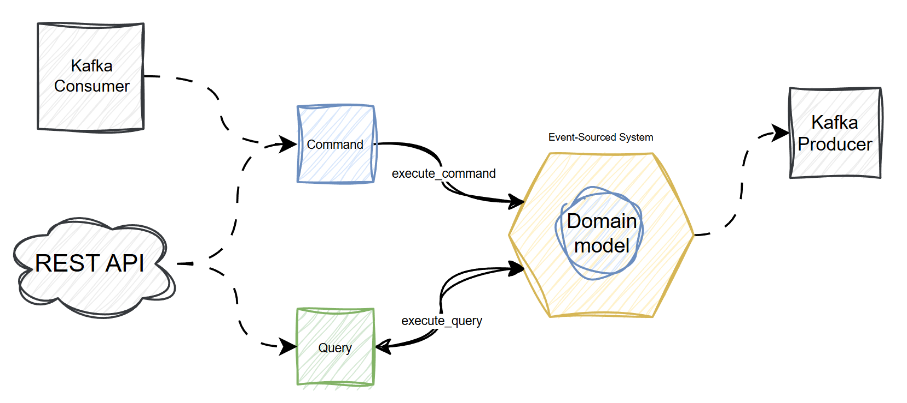
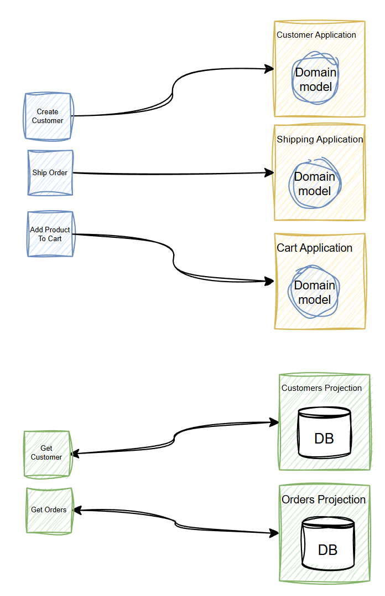
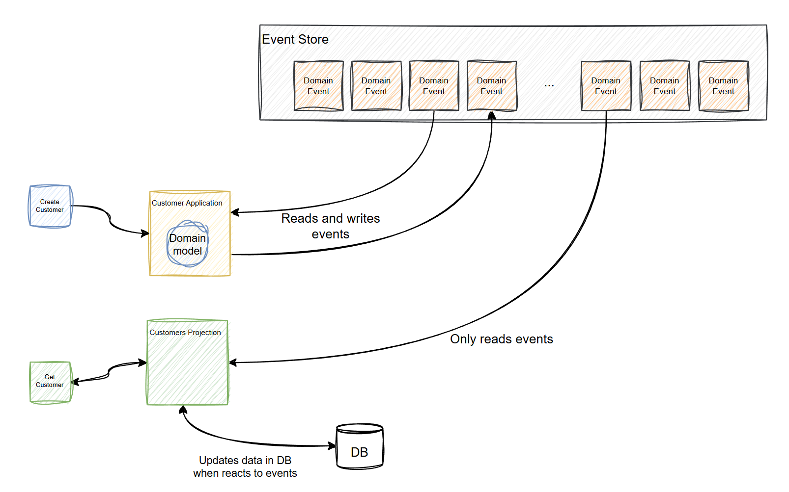
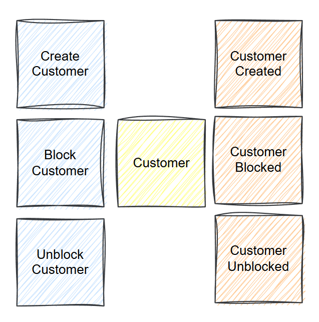

======================
Architectural overview
======================

This chapter will give you a necessary architectural and conceptual overview of the framework.

System
------

When working with Bestagon, your end goal is to develop an event-sourced system that is able to communicate
with the outside world and to react to events generated by a domain model.

The system represents a boundary around the domain model. It receives commands and queries which is one
and the only way for the system to communicate with the outside world.

`Command` is what drives business logic inside the system. The name of a command is usually a verb that states
an intention to change something. For example: CreateCustomer, CreateOrder and so on. When a system executes a
command, it starts a specific use case by calling a command handler.
The command handler executes business logic and returns nothing.

`Query` on the other hand, never executes business logic.
Its goal is to retrieve data from the system for various reasons.
For example, reporting. When the system receives a query, it routes it to the responsible query handler,
which retrieves necessary data from the reporting database and returns it.

Such an approach gives a lot of flexibility in terms of how exactly you trigger business logic in the
system and retrieve data from it. You can pass commands and queries to the system manually, use
REST API, AI Agents, Kafka consumers or any technology available to you.

Applications and Projections
----------------------------

Now let's take a look at what is inside the system.

The system mainly consists of applications and projections with clear functional boundaries.

Application is a component where your domain model lives.
It receives commands and executes use cases that change the state of your system.
Each application contains its own domain model and can react to events that are happening in the system.

Projection does not contain business logic, its purpose is to serve as a read
model to provide different analytical information. Projection can be easily dropped and rebuilt if necessary,
or removed completely without the fear of losing critical information.

When working with an event-sourced system, you usually have an event store where all events are stored in chronological order.

Applications add events to the events store when executing use cases. They also read events from it and react to them by executing use cases automatically.

Projections only read events from the event store, and populate read models.

Aggregate
---------

Aggregate is another crucial part of your system.
You implement your domain model using event-sourced aggregates and your business logic lives inside an aggregate.
They serve as a source of domain events - when you execute business logic inside an aggregate, it usually changes the state of the aggregate.
These changes are captured as immutable events and exactly these events are stored in an event store.
Let's take a Customer aggregate as an example - it can be Created, if a Customer has suspicious behavior,
it can be Blocked and Unblocked if analysis shows that everything is good for the customer.

In almost all cases, you do not work with aggregates directly, you implement use cases in your application classes
where you create or retrieve existing aggregates, execute business logic and save changes in repository.

These are the basic building blocks of your system. In the next chapter we will take a look at the Aggregate in more detail.